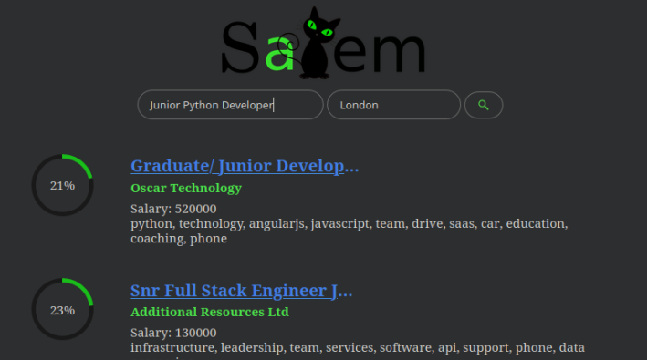

# Salem
Salem is a bare bone job aggregator and online job market analysis tool I created from scratch in exactly 1 month. 

The core scraper is FAST; it creates a thread for each websites and process the incoming responses with a pipeline asynchronously. 
It's architecture is very similar to a micro framework and new scrapers can be added rather easily.

There is still a lot to do to make this a proper application/website but I created this as a quick challenge and out of interest in data analysis as well as learning async operations and matplotlib. 

### Search and match job offers to your CV: 
`salem`  



### Report salary statistics for your queries:
`salem -r`  


## Install
`pip3 install git+https://github.com/Ecolow/salem.git`

## Help 
`salem -h`

## Project Scope
```
-------------------------------------------------------------------------------
Language                     files          blank        comment           code
-------------------------------------------------------------------------------
Python                          10            296            250            776
CSS                              2             22             15            260
JavaScript                       1             36             14             94
HTML                             1              0              0             28
JSON                             1              0              0              3
-------------------------------------------------------------------------------
SUM:                            15            354            279           1161
-------------------------------------------------------------------------------
```
